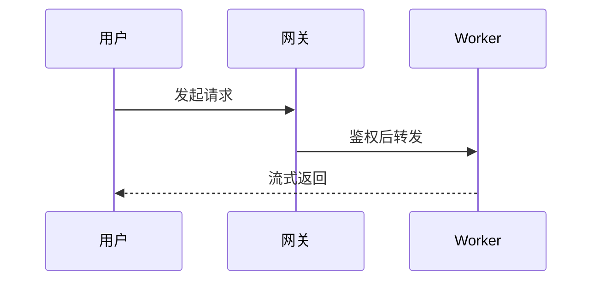

# 画 Mermaid 图(时序 / ER / 状态机 / 甘特)

这几类用 SVG 手画很吃力,交给 mermaid:**时序图、类图 / ER 图、状态机、甘特图**。
**架构图 / 流程图 / 结构图 / 概念示意**不要用 mermaid——用 `load_skill("make-diagram")` 画更精致的内联中文 SVG。

1. 选类型:时序 `sequenceDiagram`、类图 `classDiagram`、ER 图 `erDiagram`、状态 `stateDiagram-v2`、甘特 `gantt`。
2. 用 mermaid 语法写出来,放进 ```mermaid 代码块,Snowan 会直接渲染。
3. 节点 / 标签用中文且简短,关系写在箭头上,别把所有细节塞进一张。
4. 图下面用一两句话说明它表达了什么。

示例(时序):


