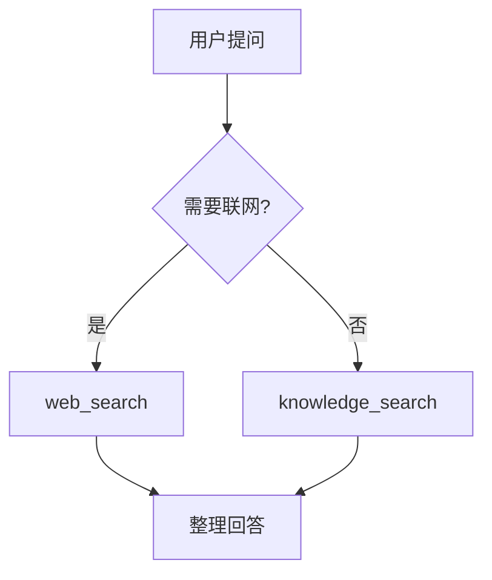

# 画 Mermaid 图

当用户要「画个流程图 / 时序图 / 架构图 / 把这个画出来」时:

1. 选最合适的图类型:流程 `flowchart TD`、时序 `sequenceDiagram`、类图 `classDiagram`、状态 `stateDiagram-v2`、思维导图 `mindmap`、甘特 `gantt`。
2. 用 Mermaid 语法写出来,放进 ```mermaid 代码块,Snowan 会直接渲染成图。
3. 保持简洁:节点文字短(≤6 字),箭头上写关系,层级清晰,别把所有细节塞进一张图。
4. 图下面用一两句话说明它表达了什么。

示例:



要点:节点命名清楚、不要超过 ~15 个节点;复杂系统拆成几张小图而不是一张大图。
